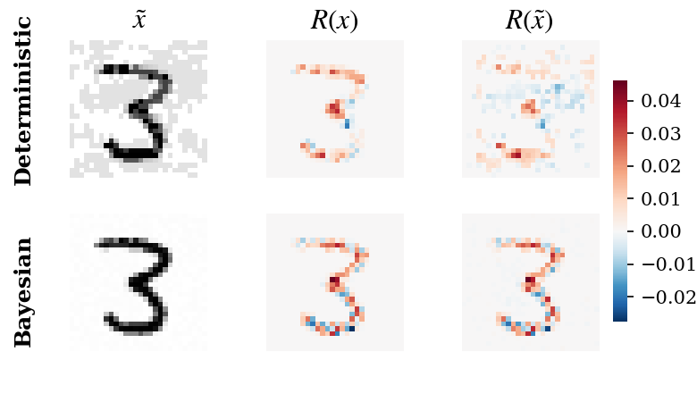
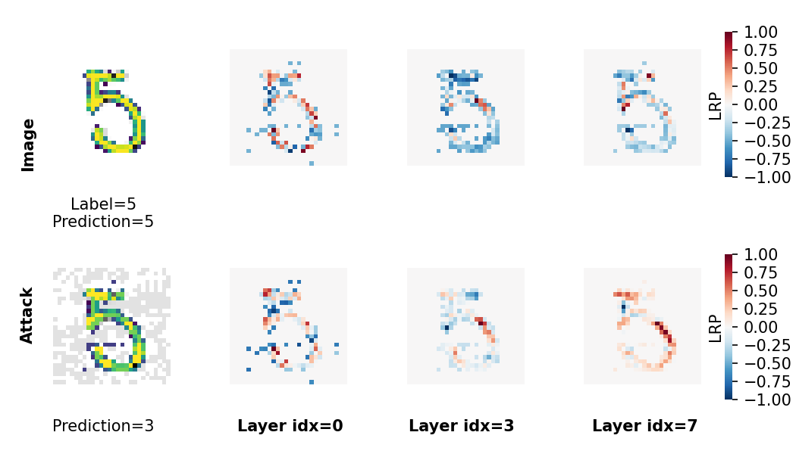
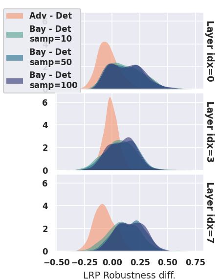
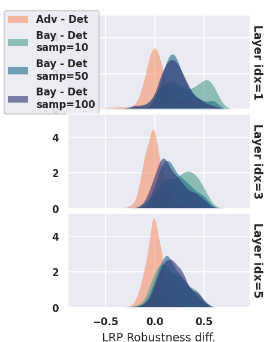
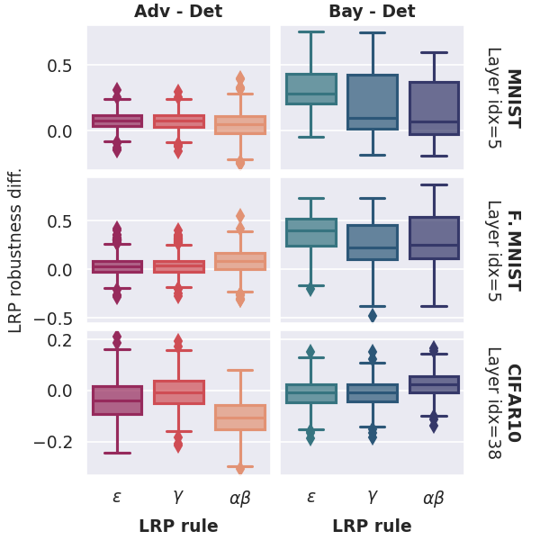
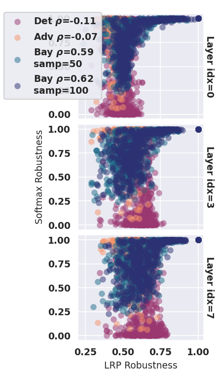
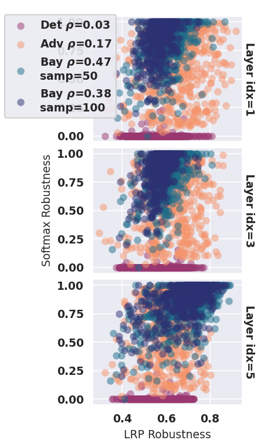

## Resilience of Bayesian Layer-Wise Explanations under Adversarial Attacks

Ginevra Carbone, Guido Sanguinetti, Luca Bortolussi, 2021

### Abstract
We consider the problem of the stability of saliency-based explanations of Neural Network predictions under adversarial attacks in a classification task. We empirically show that, for deterministic Neural Networks, saliency interpretations are remarkably brittle even when the attacks fail, i.e. for attacks that do not change the classification label. By leveraging recent results, we provide a theoretical explanation of this result in terms of the geometry of adversarial attacks. Based on these theoretical considerations, we suggest and demonstrate empirically that saliency explanations provided by Bayesian Neural Networks are considerably more stable under adversarial perturbations. Our results not only confirm that Bayesian Neural Networks are more robust to adversarial attacks, but also demonstrate that Bayesian methods have the potential to provide more stable and interpretable assessments of Neural Network predictions. 


## Experiments

### Install

Code runs with Python 3.7.4. on Ubuntu 18.10.

```
pip3 install virtualenv
virtualenv -p python3 venv
source venv/bin/activate
pip install -r requirements.txt
cd src/
```

### Train and attack models 

Set model architecture and parameters in `utils/model_settings.py`.
To choose your device pass --device="cpu" or --device="cuda" to the script.

***Example:***

Train a deterministic network with a convolutional architecture (`model_0` from settings) on MNIST:

```
python train_networks.py --model=baseNN --model_idx=0
```

Attack with FGSM on 500 test points:

```
python attack_networks.py --model=baseNN --model_idx=0 --attack_method=fgsm --n_inputs=500
```

### Compute LRP heatmaps

Compute LRP heatmaps on all learnable layers using epsilon rule:

```
python compute_lrp.py --model=baseNN --model_idx=0 --attack_method=fgsm --n_inputs=500 --rule=epsilon
```

### Reproduce plots

Plots are saved in `experiments/figures/`.

*For fully automated executions please check*: `exec_layers_robustness.sh`,  `exec_rules_robustness.sh`, `exec_cifar.sh`

***Fig. 1***

```
# attack networks
python train_networks.py --model=baseNN --model_idx=2
python train_networks.py --model=fullBNN --model_idx=2

# attack networks
python attack_networks.py --model=baseNN --model_idx=2 --attack_method=fgsm --n_inputs=500
python attack_networks.py --model=fullBNN --model_idx=2 --attack_method=fgsm --n_inputs=500

# compute LRP heatmaps
python compute_lrp.py --model_idx=2 --attack_method=fgsm --n_inputs=500 --rule=epsilon

# plot
python lrp_heatmaps_det_vs_bay.py --n_inputs=500 --model_idx=2 --topk=30 --n_samples=100 --attack_method=fgsm
```


***Fig. 3***

```
# train and attack
python train_networks.py --model=baseNN --model_idx=0
python attack_networks.py --model=baseNN --model_idx=0 --attack_method=fgsm --n_inputs=500

# compute LRP heatmaps
python compute_lrp.py --model_idx=0 --attack_method=fgsm --n_inputs=500 --rule=epsilon

# plot
python lrp_heatmaps_layers.py --model=baseNN --model_idx=0 --n_inputs=500 --topk=30 --n_samples=50 --attack_method=fgsm
```


***Fig. 4***

```
# train
python train_networks.py --model=baseNN --model_idx=1
python train_networks.py --model=advNN --model_idx=1
python train_networks.py --model=fullBNN --model_idx=1

python train_networks.py --model=baseNN --model_idx=3
python train_networks.py --model=advNN --model_idx=3
python train_networks.py --model=fullBNN --model_idx=3

# attack
python attack_networks.py --model=baseNN --model_idx=1 --attack_method=fgsm --n_inputs=500
python attack_networks.py --model=advNN --model_idx=1 --attack_method=fgsm --n_inputs=500
python attack_networks.py --model=fullBNN --model_idx=1 --attack_method=fgsm --n_inputs=500 --n_samples=100

python attack_networks.py --model=baseNN --model_idx=3 --attack_method=pgd --n_inputs=500
python attack_networks.py --model=advNN --model_idx=3 --attack_method=pgd --n_inputs=500
python attack_networks.py --model=fullBNN --model_idx=3 --attack_method=pgd --n_inputs=500 --n_samples=100

# compute LRP heatmaps
python compute_lrp.py --model=baseNN --model_idx=1 --attack_method=fgsm --n_inputs=500 --rule=epsilon
python compute_lrp.py --model=advNN --model_idx=1 --attack_method=fgsm --n_inputs=500 --rule=epsilon
python compute_lrp.py --model=fullBNN --model_idx=1 --attack_method=fgsm --n_inputs=500 --rule=epsilon --n_samples=100

python compute_lrp.py --model=baseNN --model_idx=3 --attack_method=pgd --n_inputs=500 --rule=epsilon
python compute_lrp.py --model=advNN --model_idx=3 --attack_method=pgd --n_inputs=500 --rule=epsilon
python compute_lrp.py --model=fullBNN --model_idx=3 --attack_method=pgd --n_inputs=500 --rule=epsilon --n_samples=100

# plot
python lrp_robustness_diff.py --n_inputs=500 --model_idx=1 --attack_method=fgsm --rule=epsilon 
python lrp_robustness_diff.py --n_inputs=500 --model_idx=3 --attack_method=pgd --rule=epsilon
```
 

***Fig. 5***

```
# train 

python train_networks.py --model=baseNN --model_idx=2
python train_networks.py --model=advNN --model_idx=2
python train_networks.py --model=fullBNN --model_idx=2

python train_networks.py --model=baseNN --model_idx=3
python train_networks.py --model=advNN --model_idx=3
python train_networks.py --model=fullBNN --model_idx=3

python full_test_cifar_resnet.py --mode=train --test_inputs=500
python full_test_cifar_adversarial_resnet.py --mode=train --test_inputs=500
python full_test_cifar_bayesian_resnet.py --mode=train --test_inputs=500

# attack

python attack_networks.py --model=baseNN --model_idx=2 --attack_method=fgsm --n_inputs=500
python attack_networks.py --model=advNN --model_idx=2 --attack_method=fgsm --n_inputs=500
python attack_networks.py --model=fullBNN --model_idx=2 --attack_method=fgsm --n_inputs=500 --n_samples=100

python attack_networks.py --model=baseNN --model_idx=3 --attack_method=fgsm --n_inputs=500
python attack_networks.py --model=advNN --model_idx=3 --attack_method=fgsm --n_inputs=500
python attack_networks.py --model=fullBNN --model_idx=3 --attack_method=fgsm --n_inputs=500 --n_samples=100

python full_test_cifar_resnet.py --mode=test --test_inputs=500 --attack_method=fgsm
python full_test_cifar_adversarial_resnet.py --mode=test --test_inputs=500 --attack_method=fgsm
python full_test_cifar_bayesian_resnet.py --mode=test --test_inputs=500 --attack_method=fgsm

# compute LRP

python compute_lrp.py --model=baseNN --model_idx=2 --attack_method=fgsm --n_inputs=500 --rule=epsilon
python compute_lrp.py --model=baseNN --model_idx=2 --attack_method=fgsm --n_inputs=500 --rule=gamma
python compute_lrp.py --model=baseNN --model_idx=2 --attack_method=fgsm --n_inputs=500 --rule=alpha1beta0
python compute_lrp.py --model=advNN --model_idx=2 --attack_method=fgsm --n_inputs=500 --rule=epsilon
python compute_lrp.py --model=advNN --model_idx=2 --attack_method=fgsm --n_inputs=500 --rule=gamma
python compute_lrp.py --model=advNN --model_idx=2 --attack_method=fgsm --n_inputs=500 --rule=alpha1beta0
python compute_lrp.py --model=fullBNN --model_idx=2 --attack_method=fgsm --n_inputs=500 --rule=epsilon
python compute_lrp.py --model=fullBNN --model_idx=2 --attack_method=fgsm --n_inputs=500 --rule=gamma
python compute_lrp.py --model=fullBNN --model_idx=2 --attack_method=fgsm --n_inputs=500 --rule=alpha1beta0

python compute_lrp.py --model=baseNN --model_idx=3 --attack_method=fgsm --n_inputs=500 --rule=epsilon
python compute_lrp.py --model=baseNN --model_idx=3 --attack_method=fgsm --n_inputs=500 --rule=gamma
python compute_lrp.py --model=baseNN --model_idx=3 --attack_method=fgsm --n_inputs=500 --rule=alpha1beta0
python compute_lrp.py --model=advNN --model_idx=3 --attack_method=fgsm --n_inputs=500 --rule=epsilon
python compute_lrp.py --model=advNN --model_idx=3 --attack_method=fgsm --n_inputs=500 --rule=gamma
python compute_lrp.py --model=advNN --model_idx=3 --attack_method=fgsm --n_inputs=500 --rule=alpha1beta0
python compute_lrp.py --model=fullBNN --model_idx=3 --attack_method=fgsm --n_inputs=500 --rule=epsilon
python compute_lrp.py --model=fullBNN --model_idx=3 --attack_method=fgsm --n_inputs=500 --rule=gamma
python compute_lrp.py --model=fullBNN --model_idx=3 --attack_method=fgsm --n_inputs=500 --rule=alpha1beta0

# plot
python lrp_rules_robustness_main.py --n_inputs=500 --topk=20 --n_samples=100 --attack_method=fgsm
```




***Fig. 6***

```
# train
python train_networks.py --model=baseNN --model_idx=0
python train_networks.py --model=advNN --model_idx=0
python train_networks.py --model=fullBNN --model_idx=0

python train_networks.py --model=baseNN --model_idx=2
python train_networks.py --model=advNN --model_idx=2
python train_networks.py --model=fullBNN --model_idx=2

# attack
python attack_networks.py --model=baseNN --model_idx=0 --attack_method=fgsm --n_inputs=500
python attack_networks.py --model=advNN --model_idx=0 --attack_method=fgsm --n_inputs=500
python attack_networks.py --model=fullBNN --model_idx=0 --attack_method=fgsm --n_inputs=500 --n_samples=10
python attack_networks.py --model=fullBNN --model_idx=0 --attack_method=fgsm --n_inputs=500 --n_samples=50
python attack_networks.py --model=fullBNN --model_idx=0 --attack_method=fgsm --n_inputs=500 --n_samples=100

python attack_networks.py --model=baseNN --model_idx=2 --attack_method=pgd --n_inputs=500
python attack_networks.py --model=advNN --model_idx=2 --attack_method=pgd --n_inputs=500
python attack_networks.py --model=fullBNN --model_idx=2 --attack_method=pgd --n_inputs=500 --n_samples=10
python attack_networks.py --model=fullBNN --model_idx=2 --attack_method=pgd --n_inputs=500 --n_samples=50
python attack_networks.py --model=fullBNN --model_idx=2 --attack_method=pgd --n_inputs=500 --n_samples=100

# compute LRP heatmaps
python compute_lrp.py --model=baseNN --model_idx=0 --attack_method=fgsm --n_inputs=500 --rule=epsilon
python compute_lrp.py --model=advNN --model_idx=0 --attack_method=fgsm --n_inputs=500 --rule=epsilon
python compute_lrp.py --model=fullBNN --model_idx=0 --attack_method=fgsm --n_inputs=500 --rule=epsilon --n_samples=10
python compute_lrp.py --model=fullBNN --model_idx=0 --attack_method=fgsm --n_inputs=500 --rule=epsilon --n_samples=50
python compute_lrp.py --model=fullBNN --model_idx=0 --attack_method=fgsm --n_inputs=500 --rule=epsilon --n_samples=100

python compute_lrp.py --model=baseNN --model_idx=2 --attack_method=pgd --n_inputs=500 --rule=epsilon
python compute_lrp.py --model=advNN --model_idx=2 --attack_method=pgd --n_inputs=500 --rule=epsilon
python compute_lrp.py --model=fullBNN --model_idx=2 --attack_method=pgd --n_inputs=500 --rule=epsilon --n_samples=10
python compute_lrp.py --model=fullBNN --model_idx=2 --attack_method=pgd --n_inputs=500 --rule=epsilon --n_samples=50
python compute_lrp.py --model=fullBNN --model_idx=2 --attack_method=pgd --n_inputs=500 --rule=epsilon --n_samples=100

# plot
python lrp_robustness_scatterplot.py --n_inputs=500 --model_idx=0 --attack_method=fgsm --rule=epsilon
python lrp_robustness_scatterplot.py --n_inputs=500 --model_idx=2 --attack_method=pgd --rule=epsilon
```

 

### Appendix plots

***Fig. 7-9, 16***

`./exec_layers_robustness.sh`

***Fig. 10-15***

```
./exec_rules_robustness.sh
./exec_cifar.sh
```

