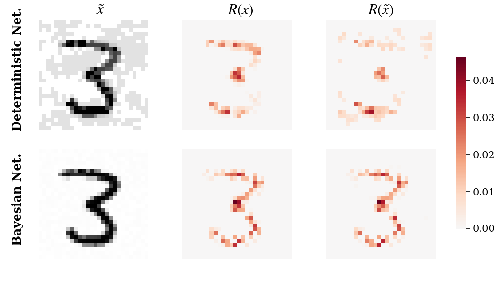
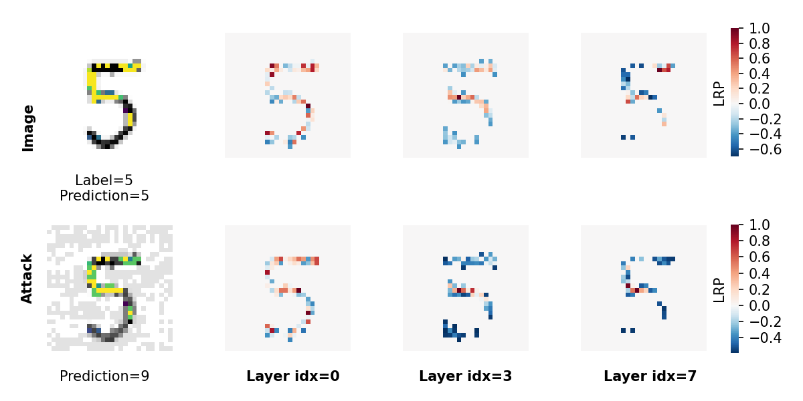
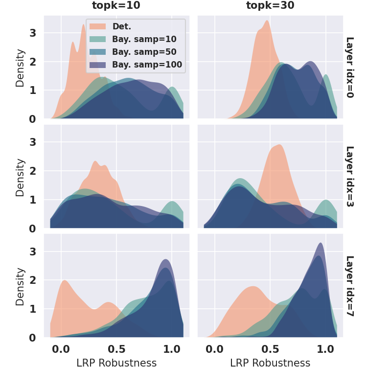

# Resilience of Bayesian Layer-Wise Explanations under Adversarial Attacks

Ginevra Carbone, Guido Sanguinetti, Luca Bortolussi, 2021

### Abstract
We consider the problem of the stability of saliency-based explanations of Neural Network predictions under adversarial attacks in a classification task. We empirically show that, for deterministic Neural Networks, saliency interpretations are remarkably brittle even when the attacks fail, i.e. for attacks that do not change the classification label. By leveraging recent results, we provide a theoretical explanation of this result in terms of the geometry of adversarial attacks. Based on these theoretical considerations, we suggest and demonstrate empirically that saliency explanations provided by Bayesian Neural Networks are considerably more stable under adversarial perturbations. Our results not only confirm that Bayesian Neural Networks are more robust to adversarial attacks, but also demonstrate that Bayesian methods have the potential to provide more stable and interpretable assessments of Neural Network predictions. 


# Experiments

### Install

Code runs with Python 3.7.4. on Ubuntu 18.10.

```
pip3 install virtualenv
virtualenv -p python3 venv
source venv/bin/activate
pip install -r requirements.txt
cd src/
```

### Train and attack models 

Set model architecture and parameters in `utils/model_settings.py`. 

Train a deterministic network and a Bayesian network with the same architecture (`model_0` from settings) on MNIST:

```
python train_networks.py --model=baseNN --model_idx=0
python train_networks.py --model=fullBNN --model_idx=0
```

Attack both networks with FGSM on 500 test points:

```
python attack_networks.py --model=baseNN --model_idx=0 \
		--attack_method=fgsm --n_inputs=500
python attack_networks.py --model=fullBNN --model_idx=0 \
		--attack_method=fgsm --n_inputs=500
```

### Compute LRP heatmaps

Compute LRP heatmaps on all learnable layers using epsilon rule:

```
python compute_lrp.py --model_idx=0 --attack_method=fgsm \
		--n_inputs=500 --rule=epsilon
```

### Reproduce plots

```
python lrp_heatmaps_det_vs_bay.py --n_inputs=500 --model_idx=2 \
		--topk=100 --n_samples=100 --attack_method=fgsm --lrp_method=avg_heatmap 
```



```
python lrp_heatmaps_layers.py --model=baseNN --model_idx=0 \
		--n_inputs=500 --topk=100 --n_samples=50 --attack_method=fgsm \
		--lrp_method=avg_heatmap --normalize=True
```


```
python lrp_layers_robustness.py --n_inputs=500 --model_idx=0 \
		--model=fullBNN --attack_method=fgsm --rule=epsilon
```
(*This takes a while!*)



